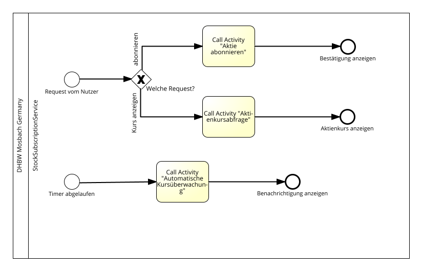

<h1> Dokumentation der Projektarbeit </h1>
<h2> Projekt: Stock Subscription Service</h2>
<h3> von </h3>
<h3>John Hohn, Simon Hopfhauer, Tilman Voit</h3>

<h2> Inhaltsverzeichnis </h2> <!-- omit in toc -->

- [Organisatorisches](#organisatorisches)
  - [Gruppenmitglieder](#gruppenmitglieder)
  - [Projektplan](#projektplan)
  - [Aufgabenverteilung](#aufgabenverteilung)
  - [Verwendete Technologien](#verwendete-technologien)
  - [Verwendete APIs](#verwendete-apis)
- [Grundidee der Web-Applikation](#grundidee-der-web-applikation)
- [Beschreibung der verwendeten Services](#beschreibung-der-verwendeten-services)
- [Gesamtprozess](#gesamtprozess)
- [Prozess: Aktie abonnieren](#prozess-aktie-abonnieren)
- [Prozess: Aktienkursabfrage mit Währungsumrechung](#prozess-aktienkursabfrage-mit-währungsumrechung)
- [Prozess: Automatische Kursüberwachung](#prozess-automatische-kursüberwachung)

 

## Organisatorisches

### Gruppenmitglieder

| Name | Matrikelnummer |
| -----| ----- |
| John Hohn| 4692407|
| Simon Hopfhauer| 6092891|
| Tilman Voit| 5136540|

### Projektplan

| | |
|---|---|
| 06.02.26 | Ideenfindung/Projekt-Start|
| 11.02.2026| Erstellung BPMN-Diagramme |
| 13.02.2026 | Besprechung zu BPMN-Diagrammen|
| 27.02.2026| Fertigstellung: Implementierung|
| 04.03.2026 | Abschlussbesprechung |
| 10.03.2026| Fertigstellung: Präsentation |

### Aufgabenverteilung

| Aufgabe | Teammitglied |
| ---- | ----|
| BPMN: | |
| Aktie abonnieren | Simon Hopfhauer |
| Aktienkursabfrage | John Hohn |
| Automatische Kursüberwachung | Tilman Voit |
| Implementation: ||
| Auswahl und Analyse externer APIs | Tilman Voit|
| Subscription-Service | Simon Hopfhauer |
| Composite-Service (StockSubscriptionService)| John Hohn|
| Alert-Logik | Tilman Voit|
| Eingabevalidierung | John Hohn|
| Fehlerbehandlung | Simon Hopfhauer|
| Testen mit SOAP-UI|Tilman Voit |
| Dokumentation: ||
| Architektur-Beschreibung | John Hohn|
| Service-Komposition |Simon Hopfhauer|
| OPENAPI| Tilman Voit|
| UI:||
| Eingeben der Daten | Tilman Voit|
| Anzeigen der Ergebnisse| John Hohn| 

### Verwendete Technologien
* Quarkus
* REST
* JSON (Datenformat)
* Docker

### Verwendete APIs
* CurrencyService: https://cdn.jsdelivr.net/npm/@fawazahmed0/currency-api@latest/v1/currencies/usd.json
* StockService: https://www.alphavantage.co/
  

## Grundidee der Web-Applikation

Die Web-Applikation „StockSubscriptionService“ soll es Nutzern ermöglichen, Aktien gezielt zu abonnieren und jederzeit aktuelle Kursinformationen einzusehen. Zusätzlich können Nutzer optional Benachrichtigungen erhalten, wenn eine Aktie einen bestimmten Schwellenwert erreicht oder es größere Kursänderungen gibt. Das Ziel ist, eine einfache, aber funktionale Plattform zu schaffen, auf der man mehrere Aktien gleichzeitig verfolgen kann, ohne dass ein komplexes Login-System notwendig ist. Die Eingabe der Aktien erfolgt direkt über den Namen oder das Symbol der Aktie, wodurch die Bedienung möglichst unkompliziert bleibt. Technisch betrachtet soll die Applikation mehrere Services kombinieren, um die einzelnen Aufgaben zu übernehmen, sodass der Hauptservice selbst nur die Orchestrierung der Abläufe übernimmt. Dadurch lässt sich der Prozess übersichtlich gestalten, und die einzelnen Services können unabhängig voneinander entwickelt, getestet und ggf. ausgetauscht werden. Auf diese Weise wird die Grundidee der Anwendung, aktuelle Aktieninformationen schnell und zuverlässig bereitzustellen und Nutzer über relevante Kursentwicklungen zu informieren, klar abgebildet.

 

---

 

## Beschreibung der verwendeten Services

Die Web-Applikation basiert auf mehreren Web-Services, die jeweils spezielle Aufgaben übernehmen und gemeinsam den „StockSubscriptionService“ als Composite-Service bilden. Der **StockSubscriptionService** ist der zentrale Service, der die verschiedenen Services aufruft und die Daten zusammenführt. Der **Alert-Service** prüft dabei, ob eine große Kursveränderung im Vergleich zum letzten Datenpunkt vorliegt, und erzeugt bei Bedarf eine Benachrichtigung. Der **Subscription-Service** verwaltet, welche Aktien von welchen Nutzern abonniert wurden, speichert diese Informationen und stellt sie für die Kursabfrage bereit. Für die aktuellen Kursdaten wird ein externer **StockService** verwendet, der über öffentliche APIs wie Alpha Vantage oder Finnhub die aktuellen Aktienkurse bereitstellt. Falls der Nutzer die Kurse in einer anderen Währung angezeigt bekommen möchte, greift die Applikation zusätzlich auf einen externen **CurrencyService** zurück, der die Umrechnung übernimmt. Durch diese Kombination aus internen und externen Services entsteht ein flexibles System, das sowohl die Orchestrierung der Daten übernimmt als auch auf externe, aktuelle Informationen zugreift, während Alerts und Abos unabhängig davon verwaltet werden. So wird die Funktionalität der Applikation modular und nachvollziehbar umgesetzt.

## Gesamtprozess

Der dargestellte Gesamtprozess beschreibt die Orchestrierung des StockSubscriptionService als zentralen Composite Service. Der Ablauf kann entweder durch eine Benutzeranfrage oder durch ein zeitgesteuertes Ereignis gestartet werden. Im Fall einer Benutzerinteraktion beginnt der Prozess mit einem Request vom Nutzer. Über ein exklusives Gateway wird entschieden, welche Art von Anfrage vorliegt. Möchte der Nutzer eine Aktie abonnieren, wird die entsprechende Call Activity „Aktie abonnieren“ aufgerufen. Nach erfolgreicher Durchführung erhält der Nutzer eine Bestätigung. Handelt es sich hingegen um eine Kursabfrage, wird die Call Activity „Aktienkursabfrage“ gestartet, woraufhin der aktuelle Kurs berechnet und angezeigt wird.

Unabhängig davon existiert ein zweiter Startpunkt in Form eines Timer-Events. Dieses löst regelmäßig die Call Activity „Automatische Kursüberwachung“ aus. Dabei werden abonnierte Aktien überprüft und gegebenenfalls Benachrichtigungen erzeugt. Durch die Verwendung von Call Activities wird der Gesamtprozess übersichtlich gehalten, während die detaillierte Logik in separaten Teilprozessen gekapselt ist. Somit fungiert der StockSubscriptionService als Orchestrator, der unterschiedliche Abläufe koordiniert und externe sowie interne Services strukturiert einbindet.

## Prozess: Aktie abonnieren

---

 

 

Der Prozess „Aktie abonnieren“ beschreibt, wie ein Nutzer eine Aktie für die Beobachtung auswählt und in das System aufnimmt. Der Ablauf beginnt, sobald der Benutzer die gewünschte Aktie eingibt. Zunächst wird die Eingabe auf zulässige Zeichen und Länge überprüft, um sicherzustellen, dass Sonderzeichen oder unvollständige Daten nicht zu fehlerhaften Anfragen führen. Anschließend prüft der Service, ob eine gültige User-ID vorhanden ist. Fehlt diese, wird der Vorgang mit einer entsprechenden Fehlermeldung abgebrochen. Danach ruft der StockSubscriptionService den externen StockService auf, um die Existenz der Aktie zu bestätigen. Falls die Aktie nicht existiert, wird ebenfalls eine Fehlermeldung ausgegeben und der Prozess abgebrochen. Wenn alle Validierungen erfolgreich sind, wird die Abonnement-Information über den Subscription-Service gespeichert. Abschließend erhält der Benutzer eine Bestätigung, dass die Aktie erfolgreich abonniert wurde. Fehlerpfade wie ungültige Eingabe oder nicht vorhandene Aktie sind explizit vorgesehen, sodass der Prozess robust gegenüber fehlerhaften Eingaben bleibt. Die klare Trennung zwischen Benutzerinteraktion, Validierung, externem Service und Speicherung sorgt dafür, dass die Verantwortung jedes Services nachvollziehbar bleibt.

## Prozess: Aktienkursabfrage mit Währungsumrechung

--- 

 

 

Dieser Prozess beschreibt die Abfrage aktueller Aktienkurse durch den Benutzer. Der Benutzer gibt die gewünschte Aktie ein, woraufhin der StockSubscriptionService zunächst die Eingabe validiert. Ungültige Eingaben führen zu einer Fehlermeldung und einem Abbruch des Vorgangs. Nach erfolgreicher Validierung wird der StockService aufgerufen, um den aktuellen Kurs in US-Dollar abzurufen. Es wird im Anschluss der CurrencyService aufgerufen, der den Kurs in die gewünschte Währung umrechnet. Abschließend zeigt der StockSubscriptionService den umgerechneten Kurs dem Benutzer an. Der Prozess enthält somit sowohl die Interaktion mit externen Services als auch die Verarbeitung und Aggregation der Daten für die Anzeige. Durch die explizite Validierung der Eingaben und die Fehlerbehandlung ist gewährleistet, dass der Benutzer nur korrekte Informationen erhält.

## Prozess: Automatische Kursüberwachung

---

 

 
Der Prozess der automatischen Kursüberwachung dient dazu, bei größeren Veränderungen der Aktienkurse Benachrichtigungen an die Nutzer zu generieren. Der StockSubscriptionService wird durch ein Timer-Event getriggert. Zunächst prüft der Service, ob die User-ID vorhanden ist; falls nicht, wird der Vorgang abgebrochen. Danach ermittelt der Subscription-Service die abonnierten Aktien des jeweiligen Nutzers. Für jede Aktie wird der aktuelle Kurs über den StockService abgefragt. Anschließend prüft der Alert-Service, ob der Kurs eine festgelegte Schwelle überschreitet oder eine starke Veränderung im Vergleich zum letzten Datenpunkt stattgefunden hat. Falls eine Benachrichtigung notwendig ist, wird diese generiert und dem Benutzer bereitgestellt. Der Prozess endet, wenn alle Aktien geprüft wurden und ggf. Alerts versendet wurden. Durch diesen Ablauf werden wiederkehrende Prüfungen automatisiert und Nutzer rechtzeitig über wichtige Kursbewegungen informiert, während die Trennung der Services die Wartbarkeit des Systems erhöht.